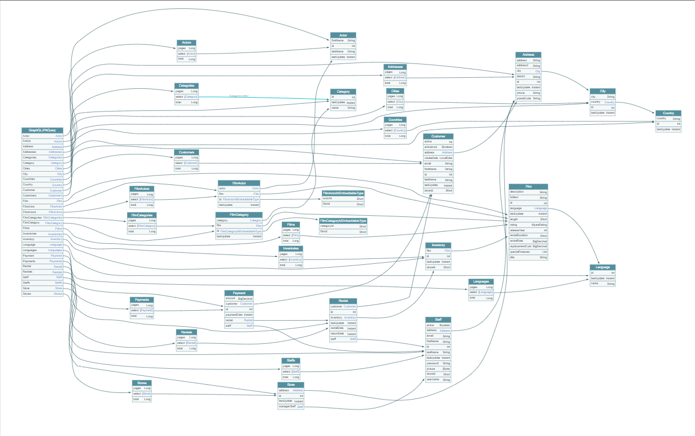

# Reverse Engineering Of Database To GraphQL Schema

## Synopsis

This a semi-automated approach to creating a GraphQL schema from an existing database schema.
Though manual coding was minimal and related to mapping custom db types to jpa entities. 
With this example database there were only 3 custom types.

## Schema Generation Results

To explore the generated schema graphically use the [GraphQL Voyager](https://apis.guru/graphql-voyager/) tool.  
Copy the contents of the [schema.graphql](docs/schema/schema.graphql) file and paste it into the tool.  
It seems to provide an accurate representation of the relationships within the db schema.  
It also provides inputs etc.

## Tools

### JPA Buddy 
[JPA Buddy](https://jpa-buddy.com/documentation/) is a plugin for IntelliJ that can create jpa entities and repositories from an existing db schema.

### graphql-jpa-query
[graphql-jpa-query](https://github.com/introproventures/graphql-jpa-query) is a library that can create a GraphQL schema from jpa entities and repositories.
I've implemented the controller from one of the provided packages, and it's possible to access the data via GraphQL queries using a client such as [Altair](https://altairgraphql.dev/)  
and pointing it at the endpoint `http://localhost:8080/graphql`.  
An advantage to this is that on adding a new entity to the db schema, the GraphQL schema is automatically updated.  
The github repository has hints of how to create mutations, and mentions support for subscriptions, but I haven't figured out how yet.

### hypersistence-utils
[hypersistence-utils](https://github.com/vladmihalcea/hypersistence-utils) is a library that provides database type mapping for jpa entities.

## Example Database

* [Download Sample Database](https://www.postgresqltutorial.com/wp-content/uploads/2019/05/dvdrental.zip)
* [Restore Sample Database](https://www.postgresqltutorial.com/load-postgresql-sample-database/)

